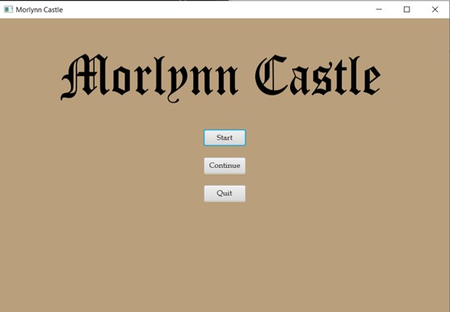
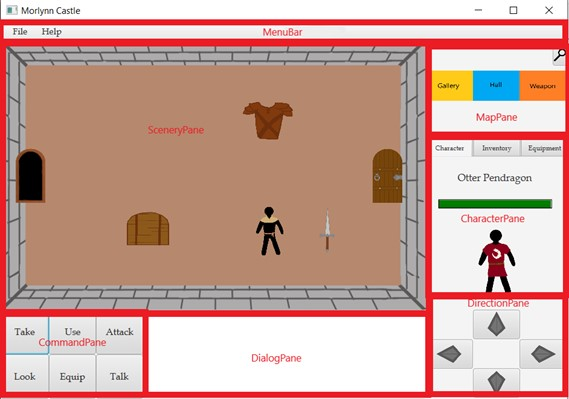
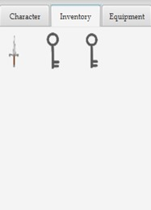
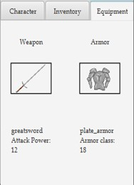
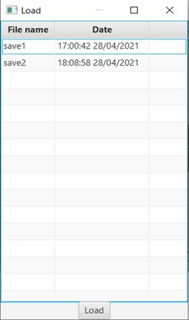
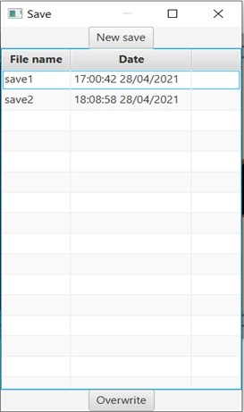
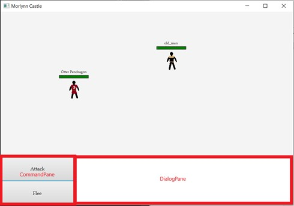

# MorlynnCastle
Projet de L3 Informatique fait par Amandine Fradet, Louis Forestier et Clémetine Guillot, dans le cadre des UE Programmation Orienté Objet et Interface Homme Machine pour appliquer l'architecture Modèle-Vue-Controlleur . Au début en ligne de commande et sans architecture MVC, il a ensuite été adapté pour la respecter avec un vue réalisé avec JavaFX.

## Manuel d’utilisation

### Interface

Le jeu commence sur une page d’accueil où l’on peut commencer une nouvelle partie, en reprendre une, ou quitter le jeu.

Si l’on commence une nouvelle partie, l’interface principale du jeu prend le relais.  

Le panneau de direction, en bas à droite, permet de changer de pièces. Attention, si des ennemis sont présents dans la pièce d’arrivée, ceux-ci ont une chance d’attaquer le personnage. Le panneau de dialogue, en bas au milieu, permet d’afficher des messages indicatifs ou d’afficher les dialogues des personnages quand on communique avec eux. Le panneau de commande, en bas à gauche, permet d’effectuer les actions inscrites (voir Utilisation des commandes). Le panneau carte, en haut à droite, affiche au centre la pièce où l’on se trouve et autour les pièces adjacentes. Le panneau central représente la pièce où l’on se trouve avec ses interactions. Le panneau du personnage, composé de trois onglets, au milieu à droite, contient les informations relatives aux héros, son inventaire et son équipement.

<table align="center">
<tbody>
<tr>
<td></td>
<td></td>
</tr>
</tbody>
</table>

La barre de menu contient un menu “File” et un menu “Help”. File contient les commande “load” et “save”, qui permettent de sauvegarder ou reprendre une partie. Le Help, contient la commande “help” et “quit”, “help” affiche l’utilisation des commandes.

<table align="center">
<tbody>
<tr>
<td></td>
<td></td>
</tr>
</tbody>
</table>

Si l’on lance un combat ou si les ennemis vous attaquent, l’interface de combat (figure5) prend le relais jusqu’à ce que vos adversaires soient tous morts, ou que vous mouriez, ou que vous fuyez.

Les combats se font en tour par tour, chaque action de votre part entraîne une riposte automatique de votre/vos adversaires. Le modèle simule un lancer de dé qui détermine si vous touchez ou non votre adversaire. Si vous touchez, les dégâts sont calculés en fonction de votre équipement et du résultat du lancer d’un second dé. La fuite est également soumise à un dé de réussite. Vous n’avez donc plus que deux commandes disponibles “attack” et “flee”. Le panneau de dialogue affiche les dégâts infligés (en plus de la barre de vie qui diminue) et si vous avez manqué votre coup. La fuite ne réussit pas forcément à tous les coups et si celle-ci échoue les ennemis en profiteront pour vous attaquer.

### Utilisation des commandes et autres fonctionnalités

On peut voir la carte globale du monde en cliquant sur la loupe en haut à droite.
Si l’on passe la souris sur un objet, qu’il soit n’importe où dans l’interface (pièce, inventaire,coffre..), sa description apparaît. Le délai peut être un peu long. 
L’intérieur d’un coffre n’est accessible que si on utilise la commande “look”.

Toutes les commandes du panneau de commande, s'utilisent de la même manière, clique sur la commande, puis clique sur l’objet. Sauf “flee”, disponible uniquement en combat, qui s’utilise tout seul.
Les commandes “look”, “take”, “attack” et “talk” s’appliquent sur les interactions disponibles dans la pièce, ou un coffre. Parler ou attaquer s’applique uniquement sur un personnage non joueur.

Les commandes “use” et “equip” s’appliquent sur des objets dans l’inventaire. Vous ne pouvez équiper que des armes et des armures. Si vous avez déjà un équipement, le changement se fait automatiquement si vous équipez un nouvel objet.
Une petite spécificité pour le “use”, on peut aussi prendre un objet dans l’inventaire et faire un glisser déposer sur un objet de la pièce. Cela permet d’utiliser un objet sur un autre.

### But du jeu

Le but du jeu est de sauver le roi d’un coup d'État. Il est retenu prisonnier dans la salle du trône. Il existe deux chemins possibles pour arriver dans la salle du trône. 

Le premier passe par hall->gallery->throne room. Le second passe par hall->weapon room->guard room->cellar->gallery->throne room. Pour le deuxième chemin, il faut prendre la clé dans le coffre du hall (small key) pour ouvrir les deux portes de la salle d'armes.

Les deux chemins nécessitent de prendre la clé dans la galerie (gold key) pour ouvrir la porte qui mène à la salle du trône. Une fois arrivé, il faut prendre la clé dans la salle du trône (heavy key) pour ouvrir la porte de sortie. Cependant, les gardes de la salle du trône vous attaqueront lorsque vous y rentrerez et vous ne pourrez fuir ce combat. Pensez donc à équiper un peu votre personnage avant d’y aller pour pouvoir les vaincre.

## Test de l'application

L’application a été testé sous Windows et Linux avec IntelliJ et Netbeans avec Java et JavaFX 8 et 15. Le répertoire res, qui contient les images, doit être au même niveau que le package MorlynnCastle, dans le répertoire src.

## Structure du code

### Modèle

Le modèle est divisé en 5 packages : characters, commands, game, items et space. 
Game contient le fichier Game.java et c’est lui qui gère le jeu. Space s’occupe de générer le monde dans lequel le héros évolue. 
Le package Command n’est plus utilisé car il reposait entièrement sur la lecture de l’entrée standard avec un scanner.  
Chaque pièce possède une collection d'Interaction. Interaction est la classe mère de toutes les choses avec lesquelles on peut interagir dans le jeu. 

### Vue

La vue MenuPane est la première à apparaître lors du lancement du jeu. La vue principale est MorlynnCastle.fxml elle représente la vue du jeu. Elle contient six sous-fichier fxml. Ces fichiers représentent chacun l’un des panneaux de la vue (figure2). La vue CharacterPane regroupe le personnage en lui-même, son inventaire et son équipement. Ce qui est intéressant dans l’inventaire est que le GridPane est inséré dans une ScrollBar. Dans le cas où le gridPane affiché à l’écran est trop petit pour tous les objets collectés, il est possible de “scroller” dans l’inventaire pour voir son entièreté sans modifier la taille de l’inventaire affichée. Les vues comme celles concernant les combats (Figure 5) ou l’ouverture des coffres seront affichées par-dessus la vue principale. 

Les interactions des pièces sont mises dans une classe InteractionView.
Les personnages sont représentés par la classe CharacterView. Cette classe contient le personnage, son nom, sa barre de vie et les attributs nécessaires pour la mettre à jour.

### Contrôleur

Chaque fichier fxml a un contrôleur qui lui est associé.

#### **MenuPaneController**

Le menuPaneController instancie le modèle (game), et le donne au morlynnCastleController. Il contient une fonction qui lance la lecture du but du jeu lorrque l’on clique sur “start”. 

#### **MorlynnCastleController**

Le contrôleur MorlynnCasltleController fait office de contrôleur général. Il appelle les autres contrôleurs pour la création de la vue. C’est lui qui effectue les modifications sur le modèle lorsqu'il y en a. Chaque sous contrôleur le contient. 

Il dispose deux fonctions qui lance les commandes l’une appelée par le sceneryPaneController et l’autre par le characterPaneController. Il contient également toutes les sous fonctions appelées par celle-ci, correspondant aux actions nécessaires aux commandes. 

#### **SceneryPaneController**

Ce contrôleur contient une fonction pour générer les objets dans le gridPane de la pièce. Chaque objet est mis dans une InteractionView au prèalable. Elle contient également deux fonctions liées à la gestion du drag and drop.

#### **CommandPaneController**

Ce contrôleur permet de passer l’action à effectuer au MorlynnCastleController qui traitera l’information. Chaque bouton transforme son action (use, take etc) en Command en utilisant Command.java et MorlynnCastleController traitera la commande pour savoir ce que l’utilisateur veut faire. 

#### **DirectionPaneController**
Le héros opère ses déplacements en utilisant ce contrôleur. Chaque bouton lance le déplacement et toutes les actions qui en découlent dans la direction souhaitée. La direction est envoyée au MorlynnCastleController qui appele les fonctions pour vérifier si la porte est fermée ou non, bouger le héros, changer de pièce, relocaliser la map et générer les objets de la pièce.

#### **MapPaneController**

Ce contrôleur contient la fonction qui génère la carte à chaque déplacement du joueur. Ainsi qu’une fonction qui génère une fenêtre popup montrant la carte entière lorsque l’on appuie sur le bouton “loupe”.

#### **CharacterPaneController**

Ce contrôleur contient les fonctions de gestion de l’inventaire, de l’équipement et de la barre de vie du héros. Il peut générer les objets présents dans l’inventaire et les supprimer. Mettre un équipement dans la vue, et l’enlever. Il possède également une fonction pour la gestion du drag and drop, qui appelle le morlynnCastelController pour faire suivre la demande.

#### **DialogBoxController**

Il dispose d’une fonction qui permet d’ajouter du texte. Mais il a principalement trois fonctions liées à la gestion des dialogues avec un Personnage non joueur. AddDialog permet d’ajouter les dialogues du personnage à l’interface, elle est seulement appelée par le contrôleur principal. Elle met en bleu le texte pour signaler qu’il est cliquable lorsque l’on passe la souris dessus.

#### **SavePaneController**

Ce contrôleur permet la sauvegarde d’une partie et de la reprendre.
ContainerPaneController
Le ContainerPaneController permet d’interagir avec les coffres et leur contenu. Le joueur peut prendre tous les objets qui y sont contenus et les ajouter à son inventaire. Le contenu des coffres est généré dès qu’on les ouvre. 

#### **CombatPaneController**

Ce contrôleur initialise les phases de combat, traite les actions attaquer et fuir, et la fin du combat. Il est le seul controller pour l’interface de combat à interagir avec le morlynnCastleController.

#### **CombatSceneryPaneController**

Avec ce contrôleur, on peut afficher le héros ainsi que le/les ennemis à combattre en appelant le combatPaneController. Chaque ennemi réagit à un événement de clic souris.

#### **CombatCommandPaneController**
CombatCommandPaneController agit un peu comme le CommandPaneController. Il envoie à CombatPaneController les actions du joueur pour les traiter.

### Le répertoire Res
Le répertoire Res situé à la racine du répertoire src, contient toutes les images utilisées dans les interfaces du jeu.
